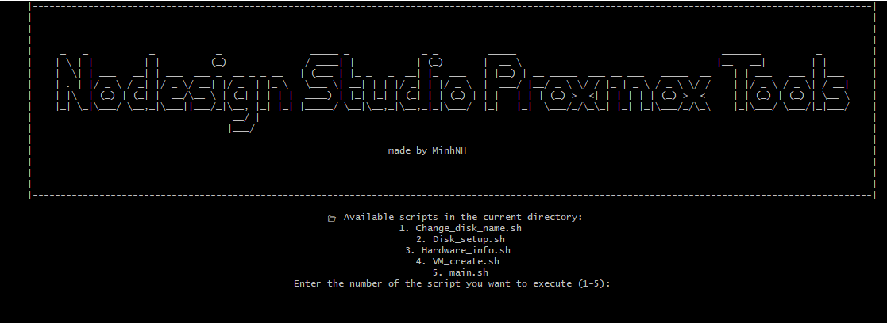

# PRM_Toolts

PRM Toolts is a simple tool that helps you manage and execute `.sh` scripts in the current directory. With a user-friendly interface and centered display, you can easily select and run scripts quickly. Every script in this tool for proxmox 7 and 8 



## Features

- **ASCII Logo Display**: A visually appealing logo is displayed when running the script.
- **List Available Scripts**: All `.sh` files in the current directory are listed and numbered.
- **Select and Execute Scripts**: You can choose a script by entering its corresponding number.
- **Centered Display**: All content is centered for a better user experience.

## How to Use

1. **Ensure Scripts Are Executable**:
   ```bash
   chmod +x *.sh
2. **Run the Main Script**:
    ```bash
    ./main.sh
3. **Select a Script to Execute**:

- After running main.sh, you will see a list of available scripts in the current directory.

- Enter the number corresponding to the script you want to execute and press Enter.

## Available Scripts
- Change_disk_name.sh: Rename disks in the system.

- Disk_setup.sh: Set up and partition new disks.

- Hardware_info.sh: Display hardware information of the system.

- VM_create.sh: Create virtual machines (VMs) on Proxmox.

- main.sh: The main script to manage and execute other scripts.

## Requirements
- Bash: The script is written in Bash, so ensure your system supports Bash.

- Root Privileges: Some scripts may require root privileges to execute.

## Contributing
- If you would like to contribute to the project, please create a pull request or open an issue to discuss.

